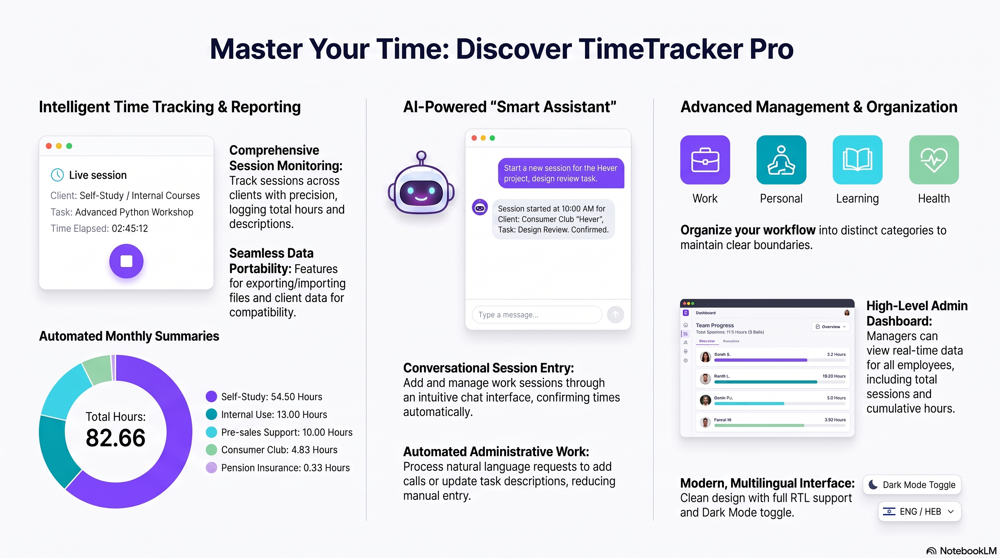

  
  
  
  

<h1 align="center">⏱️ TimeTracker Pro</h1>
<h3 align="center">Next-Generation AI-Driven Time Management & Workflow Intelligence Platform</h3>

  <b>Eliminating administrative friction and transforming daily task management into real-time operational intelligence.</b>

  <a href="#-quick-links--action-center">Quick Links</a> •
  <a href="#-executive-summary--value-proposition">Executive Summary</a> •
  <a href="#-platform-overview">Overview</a> •
  <a href="#-deep-dive-core-capabilities">Capabilities</a> •
  <a href="#-system-architecture--tech-stack">Architecture</a> •
  <a href="#-presentation--case-study">Case Study</a>

---

## ⚡ Quick Links & Action Center

| Resource | Action / Destination | Description |
| :--- | :--- | :--- |
| **🌐 Production Web App** | [**Launch TimeTracker Pro**](https://timetrackermalam.base44.app/) | Access the live interactive cloud application. |
| **📄 Executive Presentation** | [**View Slide Deck (PDF)**](./assets/Next-Gen_Workflow_Intelligence.pdf) | Complete architectural breakdown and project vision. |
| **📊 Visual Infographic** | [**View High-Res Feature Map**](./assets/Time_Tracking_Software_Features_Overview.png) | High-level system ecosystem diagram. |

---

## 🎯 Executive Summary & Value Proposition

Traditional time-tracking software forces users into tedious manual logging, complex dropdown menus, and rigid categorization schemes. This results in missing logs, accurate data loss, and zero actionable insight for team leadership.

**TimeTracker Pro** addresses this paradigm by deploying an **AI-Assisted Workflow Intelligence Engine**. Built for modern enterprises, contractors, and multi-disciplinary teams, it leverages Natural Language Processing (NLP) to convert unstructured user input into perfectly categorized, billable, and structured time entries instantly.

### 🌟 Why TimeTracker Pro?
* **Zero-Friction Logging:** Type or speak naturally; the AI handles session duration, timestamping, tag assignment, and priority ranking.
* **Operational Transparency:** Real-time dashboards provide instantaneous visual breakdowns of capacity, client distribution, and billable hour ratios.
* **Global-Ready Architecture:** Complete native support for Right-to-Left (RTL/Hebrew) and Left-to-Right (LTR/English) environments out of the box.

---

## 🖼️ Platform Overview

  

---

## 🔬 Deep-Dive Core Capabilities

### 1. 🤖 Conversational AI "Smart Assistant"
* **Natural Language Parsing:** Log activities using natural sentences like *"Spent 2.5 hours reviewing Checkmarx security reports with the dev team"*.
* **Automated Metadata Extraction:** Automatically infers client tags, urgency levels, duration, and categorizes entries under preset enterprise domains.
* **Conversational Editing:** Adjust or query past entries directly through the AI chat interface without touching a database.

### 2. 📊 Dynamic Analytics & Visualization Engine
* **Real-Time KPI Metric Cards:** Track total monthly logged hours, billable ratios, active client sessions, and target completion percentages at a glance.
* **Interactive Charts:** High-performance visual distribution charts (Bar graphs, Pie breakdowns) detailing time investment per project/category.
* **Historical Trend Analysis:** Compare month-over-month productivity metrics to identify bottlenecks and resource overallocation.

### 3. 🌐 Enterprise Multilingual & Bi-Directional Engine
* **Native RTL & LTR Translation:** Built specifically to serve cross-border teams, providing seamless switching between Hebrew and English.
* **Adaptive Interface Layouts:** UI components dynamically mirror alignment, direction, and text flows based on the chosen language profile.
* **Dark / Light Theme Engine:** High-contrast Dark Mode optimized for developers and prolonged screen usage.

### 4. 🏢 Multi-Tenant Workspace & Organizational Boundaries
* **Custom Category Hierarchy:** Categorize entries seamlessly across **Work**, **Personal**, **Learning**, **Health**, and **Custom Client Accounts**.
* **Tag & Billing Management:** Assign billable vs. non-billable indicators to ensure precision in client invoicing.

### 5. 🔄 Absolute Data Mobility & Integration
* **One-Click Export Engine:** Export structured activity logs, client summaries, and time sheets directly into CSV, JSON, or PDF formats.
* **Client Roster Sync:** Seamlessly import and sync client lists and project milestones.

---

## 🏗️ System Architecture & Tech Stack
